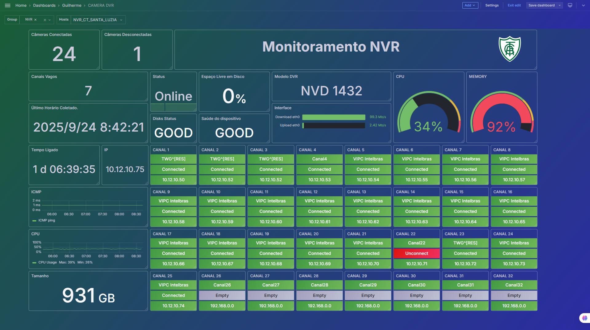
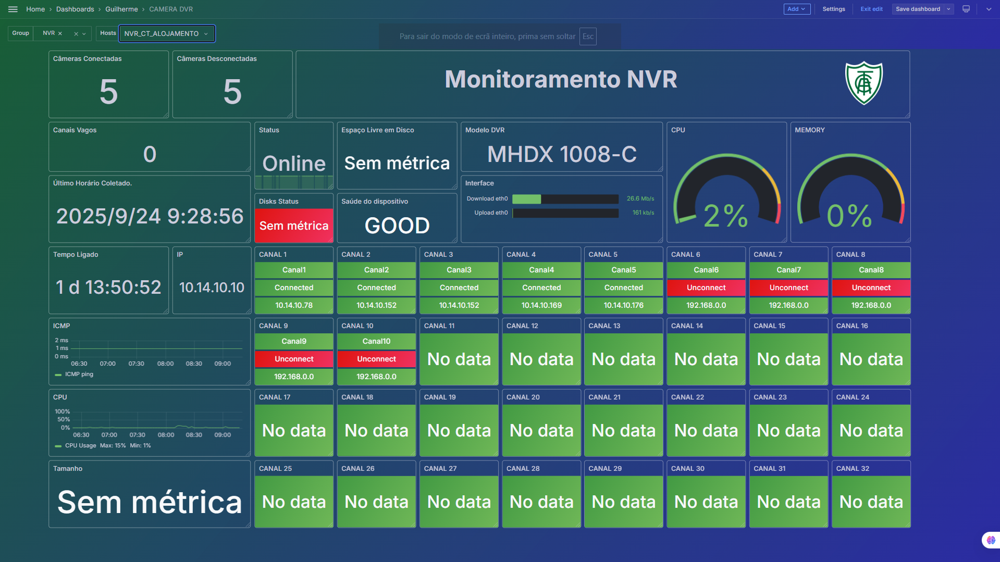

# Dashboard_cameras

# Dashboard Grafana + Template Zabbix para Monitoramento de Câmeras

Este repositório contém um **dashboard desenvolvido no Grafana** e o **template do Zabbix** utilizados para monitorar o status e as estatísticas de câmeras de CFTV.

  

  

### 🔹 Conteúdo
- **Dashboard Grafana**: painel pronto para importação no Grafana, com visualização otimizada para câmeras.  
- **Template Zabbix**: modelo utilizado como base para coleta e integração dos dados exibidos no dashboard.  

### 🔹 Funcionalidades
- Monitoramento do status de conexão das câmeras (conectado/desconectado).  
- Visualização centralizada e intuitiva no Grafana.  
- Métricas baseadas no template do Zabbix.  
- Fácil adaptação para outros ambientes de monitoramento.  

### 🔹 Compatibilidade
O painel e o template foram testados e validados nos seguintes modelos de gravadores Intelbras:
- **NVD 1432**
- **MHDX 10008-C**

### 🔹 Como importar
1. **No Zabbix**  
   - Importe o template disponível neste repositório (`zabbix-template.xml`).  
   - Configure os hosts/câmeras de acordo com o modelo.  

2. **No Grafana**  
   - Vá em **Dashboards → New → Import**.  
   - Carregue o arquivo `dashboard.json` disponível aqui.  
   - Selecione a **fonte de dados do Zabbix** configurada previamente.  

### 🔹 Exemplo de visualização
Abaixo seguem algumas capturas de tela do dashboard em funcionamento:

---
